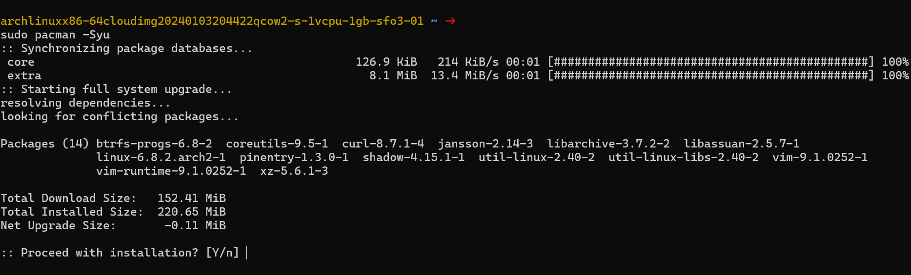

# Linux Assignment 3 Wednesday

# Step 1: install all necessary software

- a: Update pacman
- b: Install Vim
- c: Install nginx
- d: Start and enable nginx

## a: Update pacman

So Before we begin, we need to make sure we have all the software we need to complete this activity and all that software is up to date

Run the following command to update all currently installed pacman packages before we can install new ones:

```bash
sudo pacman -Syu
```

Press Y then ENTER to confirm installation. You should see the following output in this image:




*Image 1: Screenshot of pacman -Syu update*

## b: Install Vim

Vim is the primary editor we will be using to write to files. To install Vim, run the following command: 

```bash
sudo pacman -S vim
```

Press Y then ENTER to confirm installation

## c: Install nginx

> Nginx is a high-performance web server known for its stability, simplicity, and low resource consumption. It's commonly used to serve web content, handle reverse proxying, load balancing, and more. Nginx is often preferred for its ability to efficiently serve static content and its flexibility in configuring various types of web applications. - Arch Wiki
> 

```bash
sudo pacman -S nginx
```

Press Y then ENTER to confirm installation

d: Start and enable nginx

> systemctl is a command-line utility used for controlling the systemd system and service manager in Linux. It provides a way to manage system services, including starting, stopping, restarting, enabling, disabling, and checking the status of services. Systemd is the default init system for many modern Linux distributions, including Arch Linux, and systemctl is the primary tool for interacting with it. - Arch Wiki
> 

In other words, use systemctl to interact with services in Linux. Services (also known as daemons) are programs that operate in the background to allow you to interact seamlessly with your device.

The format we will be using is sudo systemctl [option] [target]. In this case, “sudo systemctl start nginx” will start the nginx service. And “enable” causes it to start on boot. Run the following commands:

```bash
sudo systemctl start nginx
sudo systemctl enable nginx
```

To check if this was successful, you can use “sudo systemctl status” to see the staus of a service. If it is enabled and active, it will display that in green. Run the following command:

```bash
sudo systemctl status nginx
```

You should see the following output in the following image:


*Image 2: Screenshot of sudo systemctl status nginx*

Congratulations. You have completed step 1: Installing all software. You are now ready for Step 2: [insert title here later]

# Step 2: Configuring Nginx to display a Web page

In this section, we will be using Nginx to display a web page. Here are the steps:

1. create project directories
2. Set up Server Block
3. Configure conf file
4. Upload to Local Git and eventually Github

## a: Create directories where we will be working.

We will create directories where we will store our files for our project and be the base for our Git repo.

We can use the “mkdir -p” command to create the multiple directories we will need for this project. Run the following command to do IN YOUR ROOT DIRECTORY:

```bash
mkdir -p as3_wed/web/html/nginx-2420-wed-assignment
```

Note the absolute path for this directory as it will be useful later. You can double check by doing echo $(realpath web/html/nginx-2420-tuesday-practise).  This will output the absolute path of the directory

Run chmod -R 755 as3_wed/web/html/nginx-2420-wed-assignment to make sure it is readible by nginx later

## b:  **Set Up a Separate Server Block**

> A server block, also known as a virtual host, is a configuration block in Nginx that defines how the server should respond to different requests. Each server block can have its own settings, such as listening port, domain name, root directory, and other configurations. - Wikipedia
> 

We need to create a new server block so we can properly respond to requests for websites. To do this, you must go to the Nginx configuration directory with “cd /etc/nginx“

The following image shows what the directory should look like:


*Image 3: Screenshot of /etc/nginx directory*

## c: Edit the existing .conf file (Note: Prof says not to do this but this was the only way I could get it to work so sorry :(

run the following command to launch Vim to create a new conf file: 

```bash
sudo vim nginx.conf
```

Edit the following information into ONLY the file\s server section using Vim:

```bash

http {
# skipping a few lines for convience 
 server {
        listen       80;
        server_name  localhost;

        #charset koi8-r;

        #access_log  logs/host.access.log  main;

        location / {
            root   /as3_wed/web/html/nginx-2420-wed-assignment; #Ensure your path is correct
            index  index.html;
        }
# skipping a few lines for convience 
include sites-enabled/*; #This should be that seperate server block that I couldn't get working :(
}
```

use “sudo systemctl restart nginx” to restart the service to allow changes to take effect

```bash
sudo systemctl restart nginx
```

### Quick Tangent

Again. I could not create a separate server block to make mine work. From my limited understanding, if you want to do that, go to your /etc/nginx directory. Create 2 directories called sites-available and sites-enabled. Transfer your content from web/html/nginx-2420 into this folder. Then create a symbolic link between these 2 directories with the following command:

```bash
sudo ln -s /etc/nginx/sites-available/as3_wed /etc/nginx/sites-enabled/
```

The idea being that in your conf file, “include sites-enabled/*;” includes all the sites listed in your sites-enabled directory. You can use the symlink feature in Linux as a way to disable or enable webpages without needing to actually move any files.

## d: Serve HTML page using git

cd to the END of the HTML directory you created earlier. Use the following screenshot for reference:


*Image 3: Screenshot of html directory*

Then, initialize a Git Repository in this directory with git init. Init is used to create a new empty repository (well, technically, it adds a git file that serves as the foundation for the git repository).

NOTE: We are not adding it to GitHub yet. That’s the next section. This section is creating a local git repo we will put on GitHub later.

```bash
git init
```

You should see the following output this screenshot: 


*Image 4: Screenshot of git init command*

Use Vim to create a file, index.html to be served:

```bash
sudo vim index.html
```

```bash
<!DOCTYPE html>
<html lang="en">
<head>
    <meta charset="UTF-8">
    <meta name="viewport" content="width=device-width, initial-scale=1.0">
    <title>2420</title>
    <style>
        * {
            color: #db4b4b;
            background: #16161e;
        }
        body {
            display: flex;
            align-items: center;
            justify-content: center;
            height: 100vh;
            margin: 0;
        }
        h1 {
            text-align: center;
            font-family: sans-serif;
        }
    </style>
</head>
<body>
    <h1>All your base are belong to us</h1>
</body>
</html>

```

Use git add to add the index.html to the staging area Git holds all changes in this staging area until you are ready to commit them later.

```bash
git add index.html
```

Use git commit to finally upload and commit the changes to just this local repo for now:

```bash
git commit -m "Initial commit"
```

Note: if you get a screen like this:


It means you have not set your Git profile. Use “ git config --global user.email "you@example.com"” and “git config --global user.name "Your Name"” to set up and link your git profile. And then run git commit -m “initial commit”

## E: Connect to GitHub:

This next step requires us to connect our local git repo on our droplet to the wider world of the internet and more specifically, GitHub.

Firstly, make sure you have an empty repo on GitHub already created and available to use. This guide will not cover how to do this in detail. The basic steps are to go to your GitHub profile, click the “+” button and create a new Repository.

 Once, that is done, we need to back to our Droplet and assign which branch it will be pushed to with “git branch -M main”. Run the following commands to begin the process.

```bash
git branch -M main
```

Once that is done, you now need to the new origin of the GitHub repository. That being its new .git file.

Run the following commands to begin the process:

```bash
git remote add origin https://github.com/yourusername/your-repo.git
```

Replace the url to your new repo’s git file

Finally, push files to the new repo:

```bash
git push -u origin main
```

Once you do this, GitHub will ask you to login. Enter your Username as Normal BUT DO NOT enter your password. GitHub removed support for terminal based password logins like that on August 13, 2021.

Instead, you must go to your GitHub developer settings and generate a new classic access token and use that in place of your password.

This article goes into more detail and explains the steps in more detail: [https://dev.to/shafia/support-for-password-authentication-was-removed-please-use-a-personal-access-token-instead-4nbk](https://dev.to/shafia/support-for-password-authentication-was-removed-please-use-a-personal-access-token-instead-4nbk)

Once you have done this, use sudo systemctl reload nginx. Then open your browser and enter in your droplet’s IP address. If you did everything correct, you should see your webpage.


*Image 5: Screenshot of final web page being rendered*

NOTE: If the images are unavailable or don't render, all screenshots are included in the screenshots directory

Here’s also a link to the GitHub where I posted my code:
